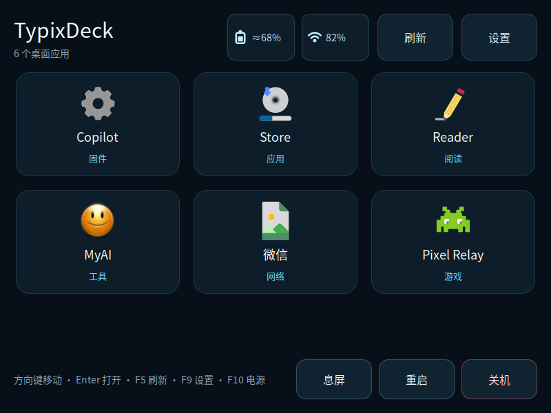
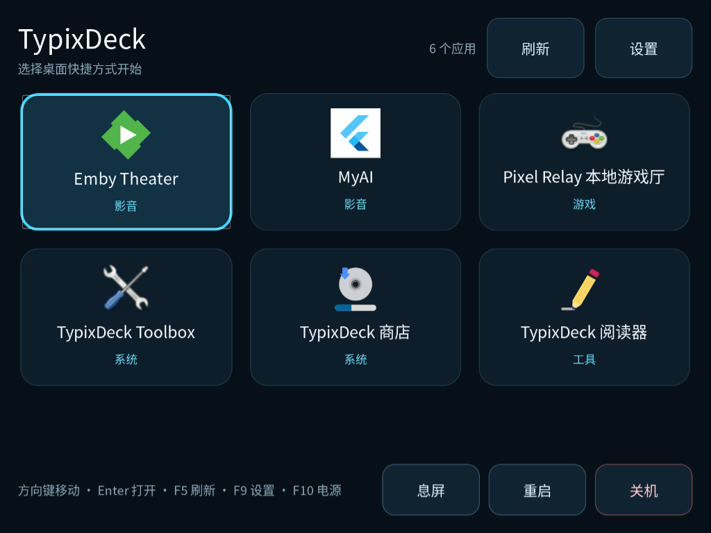
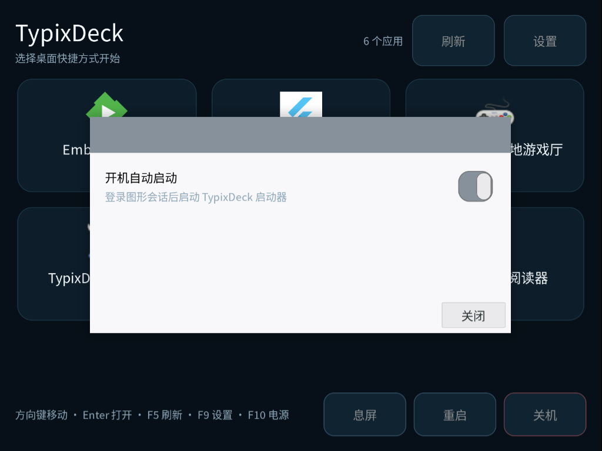
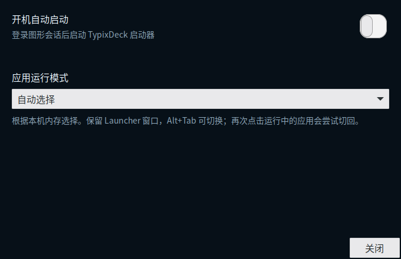

# TypixDeck Launcher

面向官方 Raspberry Pi OS ARM64 的原生全屏启动器，主验收设备为 CM4。只显示用户桌面上的 `.desktop` 快捷方式；保持深色 GTK3、约 800×600 逻辑布局、三列应用网格和键盘导航。支持单应用省内存与后台切换两种运行方式，可在设置中选择。

- 平台：官方 Raspberry Pi OS ARM64 Bookworm / Trixie，兼容性与可用功能按运行时探测。
- UI：Python 3 + PyGObject + GTK3；禁止 WebView/Electron/Node。
- Store：由独立 `typix-store` 包提供；安装应用后自动维护桌面快捷方式，可在 Store 直接启动。
- 内存策略：自动按内存选择；单应用模式先退出 Launcher UI，后台模式保留窗口供 Alt+Tab 切换。

<!-- app-screenshots:start -->



0.2.2 状态栏：CM4 原生 GTK 800×600 渲染，使用演示电量、信号和应用条目，不含设备安装清单。



桌面快捷方式首页与键盘焦点。



开机自动启动设置。

<!-- app-screenshots:end -->

## 一键安装 Launcher 和 Store

在官方 **Raspberry Pi OS ARM64 Bookworm / Trixie** 的普通桌面用户终端中运行：

```sh
curl -fsSL https://raw.githubusercontent.com/typixdeck/launcher/main/install.sh | sh
```

脚本同时安装完整的 `typix-launcher` 和 `typix-store` deb；按 `dpkg` 架构、系统版本和官方镜像标记探测兼容性，不按 CM 型号硬编码。需要系统 Python 3、`dpkg`、`apt`、`sudo` 和 HTTPS CA 证书；签名组件 `python3-cryptography` 缺失时，会通过普通的 apt 授权流程安装，应用运行依赖也由 apt 解析。sudo 和 apt 保留正常终端提示，GUI 始终以普通用户运行。

想先审查脚本或只检查、不安装：

```sh
curl -fsSL https://raw.githubusercontent.com/typixdeck/launcher/main/install.sh -o install.sh
less install.sh
sh install.sh --check
# 检查通过后安装
sh install.sh
```

`--check` 会真实下载两包，验证签名、元数据、磁盘空间、已安装版本并执行 apt 模拟；不调用 sudo，不修改软件包、配置、桌面或服务。检查模式缺少签名组件时会明确报错，不自行安装。`sh install.sh --help` 查看选项。

下载固定使用 `typixdeck/store` 仓库 `main/debs/`，不接受 catalog 指定任意下载地址。脚本内置 Ed25519 公钥，验证 catalog 的原始字节、仓库、频道与有效期，再核对两包的完整包标记、字节数、SHA-256、Package / Version / Architecture / Depends / 系统兼容字段。授权阶段将文件复制到只有 root 能修改的临时目录，重新验证后才交给 `apt-get --no-remove install`；拒绝降级和未完成的 dpkg 事务。公钥不从本次下载中获取；安装脚本本身的初始信任来自上面的 Launcher GitHub HTTPS 地址，建议需要审查时先下载再执行。

首次安装仅在路径缺失时建立 `/usr/share/typix-store/keys/bootstrap.pem` 和 `/etc/typix-store/github.json`。已有等价源与匹配公钥可继续使用；冲突的自定义源或公钥会保留并中止安装，要求管理员先检查。安装器保留现有配置、用户数据和自定义桌面快捷方式，只在缺失时添加 Store 桌面入口，不添加 Launcher 自身 tile。

默认不启动、重启或启用 Launcher 服务，避免覆盖正在使用的应用。准备好后运行：

```sh
systemctl --user start typix-launcher.service
# 也可以明确选择在安装完成后启动：
sh install.sh --start
```

开机启动仍由 Launcher 设置页（`F9`）控制。同版本再次运行会重新验证，apt 保持已安装版本；更高的已安装版本不会被降级。下载有大小、读取超时与空间限制，断网或取消后可重新运行；包事务开始后请等待 apt 完成，安装器不会强制终止 dpkg，也不会自动重放失败事务。

## 应用运行模式（0.3.0）



打开设置（F9）→ **应用运行模式**，选项立即保存到用户配置，下一次启动应用时使用：

| 模式 | 行为 |
| --- | --- |
| 自动选择 | 按运行时读取的总内存选择：至少 1.5 GiB 使用后台模式，其余或检测失败使用单应用模式；不按 CM0/CM4 名称判断 |
| 单应用 · 省内存 | 启动应用前退出 Launcher 界面，等待前台应用关闭后重建；应用运行期间 Alt+Tab 中没有 Launcher |
| 后台模式 · Alt+Tab 切换 | 保留 Launcher 窗口，可切回启动其他应用；窗口失去焦点时停止电量/Wi-Fi 采样 |

后台模式对同一个 `.desktop` 启动项抑制重复启动；再次点击时，通过支持的 Wayland 窗口协议请求切回已有主窗口。已检测到窗口却不能激活时会提示使用 Alt+Tab，不再启动一份副本。X11/不支持协议的桌面保留“同一启动项不重复启动”，需要用系统窗口切换。多个窗口共享同一 app ID 时不猜测目标，改为提示 Alt+Tab。不同快捷方式即使使用同一程序，也会分别执行各自的文件或 URL 参数。

切回单应用模式时保留现有工作，需要先关闭由 Launcher 打开的后台应用再启动新的应用；不会强杀程序或丢弃编辑内容。此设置管理 Launcher 启动的应用，不会关闭用户另外启动的后台服务。首次用后台模式多开重型应用仍受实际可用内存限制。

配置：`$XDG_CONFIG_HOME/typix-launcher/runtime.json`（默认 `~/.config/typix-launcher/runtime.json`），写入失败保留原设置。源码预览使用内存中的演示设置，不写这个文件。

## 电量与 Wi-Fi（0.2.2）

顶部使用纯图标表示电池电量和 Wi-Fi 信号，每 10 秒更新；鼠标悬停可查看来源、读数与状态。没有状态按钮或刷新按钮，每次打开 Launcher 自动重新读取桌面快捷方式，目录变化也会自动更新。应用数量位于标题下方，保留三列网格。

- 优先读取 Linux `power_supply` 系统电池，支持充电图标；不会误用蓝牙鼠标/键盘的电池。
- 没有系统电池接口时，可使用已安装 Copilot 的可信板载配置读取 DIY 固件 `BATTERY_STATUS`。CW2015 悬停详情显示参考读数，属于参考电量，不能等同于校准后的 STC3117 主电量计。
- 断开、休眠中的电量计、读取失败或刷写占用时显示不可用图标，悬停说明读数缺失，不伪造 0%。该读取不会唤醒电量计、切屏、重启、刷写或修改 NVS。
- 串口读取与 Copilot 共用 root 所有的锁文件；普通用户只能读取文件并加共享锁。前台应用启动前退出采样进程并释放串口。Launcher 不在前台时停止采样。
- Wi-Fi 使用 NetworkManager 当前连接的信号（不是网速），区分关闭、未连接和未检测到网卡，不触发扫描，也不保存网络名称或地址。

可选集成依赖：NetworkManager 用于 Wi-Fi；Copilot 0.2.5、已验证的板载配置、dialout 串口权限和支持 `TD_BATT v=2` 的 DIY 固件用于电池回退。缺少接口时 Launcher 仍正常使用；GUI 无需 root，不新增常驻采样服务。

## 当前实现

```text
src/typix_launcher/
├── desktop.py       FreeDesktop 入口发现、Exec 展开、原子启动请求
├── settings.py      systemd 用户级 autostart 状态与命令
├── supervisor.py    UI 启动、前台应用等待、UI 恢复
├── runtime.py       运行模式偏好、内存检测、逐启动项任务跟踪
├── app.py           CM4 旧布局迁移 + 设置入口
└── typix-launcher.css
```

行为：

1. `typix-launcher --supervisor` 启动 `typix_launcher --ui`。
2. 单应用模式激活 tile 时，UI 先原子写入 `.desktop` 路径，再调用 `quit()` 退出。后台模式在工作线程中启动并跟踪应用，GTK 窗口保持存在。
3. 单应用模式下 supervisor 读取请求并展开 Exec，启动前台应用。
4. 单应用退出后 supervisor 重新启动 UI；后台模式中的应用退出则释放对应任务记录。
5. UI 崩溃或无请求退出时，supervisor 延后重启，systemd 只在 supervisor 自身失败时介入。

测试 `test_supervisor.py` 明确断言单应用模式事件顺序是：

```text
ui-start -> ui-quit -> app-run -> ui-start
```

## 开机自动启动

包内安装用户级 unit：

```text
/usr/lib/systemd/user/typix-launcher.service
```

Launcher Header 新增 `设置` 按钮，快捷键 `F9`。设置页提供 `开机自动启动` 开关，底层只执行用户级授权命令：

```bash
systemctl --user enable typix-launcher.service
systemctl --user disable typix-launcher.service
```

该设置不需要 root 或 sudoers。包安装后首次手动体验：

```bash
systemctl --user daemon-reload
systemctl --user start typix-launcher.service
# 打开 Launcher -> 设置 -> 开机自动启动
```

包默认不强制 enable，避免覆盖用户选择。

## 桌面入口扫描

只扫描系统桌面目录的 `*.desktop` 快捷方式。通过 `xdg-user-dir DESKTOP` 获取路径（兼容中文“桌面”或自定义桌面位置），命令不可用时回退到 `~/Desktop`。

不扫描用户或系统的 `applications` 目录。Store 为已安装的目录应用维护桌面快捷方式，Launcher 仍只读取桌面入口；普通 Linux 应用也可自行添加标准 `.desktop`，无需注册 Store。删除桌面快捷方式只会移除 Launcher 入口，不会卸载软件。首页分类按 FreeDesktop 的工具、网络、影音、游戏、系统字段显示，可用 Tab 到达分类选择框，方向键切换分类。

Store 使用固定 `--open-installed <package> <desktopFile>` 启动接口。Launcher 只检查该包的安装状态、root 管理的 `/usr/share/applications/<desktopFile>` 及其 dpkg 文件归属，不收集全系统安装清单。该接口允许启动被用户从首页隐藏的已安装应用，不扩展首页扫描范围。后台模式继续使用 AppJobs、重复启动抑制和同一全屏策略；单应用模式使用私有 nonce 请求，在 Store 退出后由现有 Supervisor 启动下一应用，中间不恢复首页。无效、过期或已变更的交接请求不会重放。

支持复制的 `.desktop`、符号链接，以及 Link 指向的本地绝对路径和 `file://` URL。保留 `Hidden`、`NoDisplay`、`TryExec`、本地化 Name/Comment、`X-TypixNode-Exclude` 和 `X-TypixDeck-Exclude` 过滤。旧的多目录环境变量不再用于扩展扫描范围。

## 构建

在 CM4 上用 ChatGPT 修改源码、运行独立预览和通过 GitHub 与 Mac 交接，见 [语音编程指南](docs/VOICE-CODING.md)。`python3 tools/preview.py` 使用当前 checkout 的界面代码和演示数据，不触发设备电源或安装操作。

```bash
./build-deb.sh
```

产物：

```text
dist/typix-launcher_0.3.1-1_all.deb
```

运行依赖：

```text
python3, python3-gi, gir1.2-gtk-3.0, xdg-user-dirs
```

推荐安装 `wlopm` 以支持息屏/唤醒。

## 测试

另有 `python3 tools/check-runtime-ui.py` 检查 GTK 模式切换与保存；`python3 tools/check-runtime-wayland.py --live-fixtures` 会短暂显示两个测试窗口，验证切换、重复启动抑制和退出，并恢复原窗口焦点，不启动真实用户应用。

```bash
PYTHONPATH=src python3 -m unittest discover -s tests -v
```

本机测试覆盖 catalog 样例、desktop 解析、autostart 命令、supervisor 恢复顺序，以及状态缺失/断连、信号边界和读写互斥。既有状态栏版本已在 CM4 验证实时读数、800×600 布局、非交互状态图标和采样进程退出。本次新增 Store 交接及分类已做本地逻辑验证，GTK/DBus/真机验收仍待完成。可在 GTK 会话中运行 `PYTHONPATH=src python3 tools/check-status-ui.py /tmp/launcher-preview.png` 重现隔离预览，不读取真实桌面清单。

## 文档索引

1. [产品需求](docs/01-PRD.md)
2. [系统架构](docs/02-ARCHITECTURE.md)
3. [UI 规格](docs/03-UI-SPEC.md)
4. [App Store Registry 与打包](docs/04-APPSTORE-REGISTRY.md)
6. [开发路线图](docs/06-ROADMAP.md)
8. [CM0 512MB 内存评估](docs/08-CM0-MEMORY-ASSESSMENT.md)
9. [Python vs Rust 技术决策](docs/09-ADR-PYTHON-VS-RUST.md)

## 真机验证

已在 CM4 Labwc / Wayland 会话验证桌面快捷方式筛选、全屏显示、键盘启动及应用关闭后的 Launcher 恢复。应用主窗口请求全屏，文件选择、确认和授权对话框保持正常尺寸。电源与息屏能力取决于系统可用接口，应在目标镜像上单独验证。

通用全屏采用启动时的 Wayland foreign-toplevel v3 请求，支持 Labwc 下的原生 Wayland 与 XWayland 窗口，不更改 compositor 全局规则。包装启动脚本可用 `X-TypixDeck-FullscreenAppId` 指定实际 app ID，见 [全屏策略](fullscreen.md)。

本仓库只发布当前应用代码、构建文件和可公开文档；历史设备快照、凭据、设备采集记录及本地运行数据不在提交范围内。

## 仓库目录

| 路径 | 用途 |
| --- | --- |
| `app.json` | 应用描述、完整 deb 版本与 SHA-256、截图索引 |
| `README.md` | 功能、真机截图、安装与使用说明 |
| `src/` | 当前程序源码或启动入口 |
| `packaging/` | desktop 与打包辅助文件 |
| `tests/` | 功能与边界验证 |
| `docs/screenshots/` | 可公开的真实运行截图 |
| `build-deb.sh` | 本地构建入口 |
| `dist/` | 构建生成的完整 deb；不提交 Git |

Launcher 保留 `packaging/debian/`、`config/`、`registry/` 与 `install.sh` 的现有入口。安装脚本及其授权行为见上方“一键安装”一节。

构建后核对并更新 `app.json` 的版本、SHA-256 和截图索引。Store 发布工具读取声明并校验完整软件包；构建不会自动签名、上传或安装。 发布格式见 [应用仓库约定](https://github.com/typixdeck/store/blob/main/docs/APP-REPOSITORY.md)。应用仓库不包含用户数据、凭据、私钥或设备采集记录。
