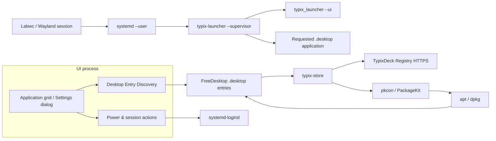
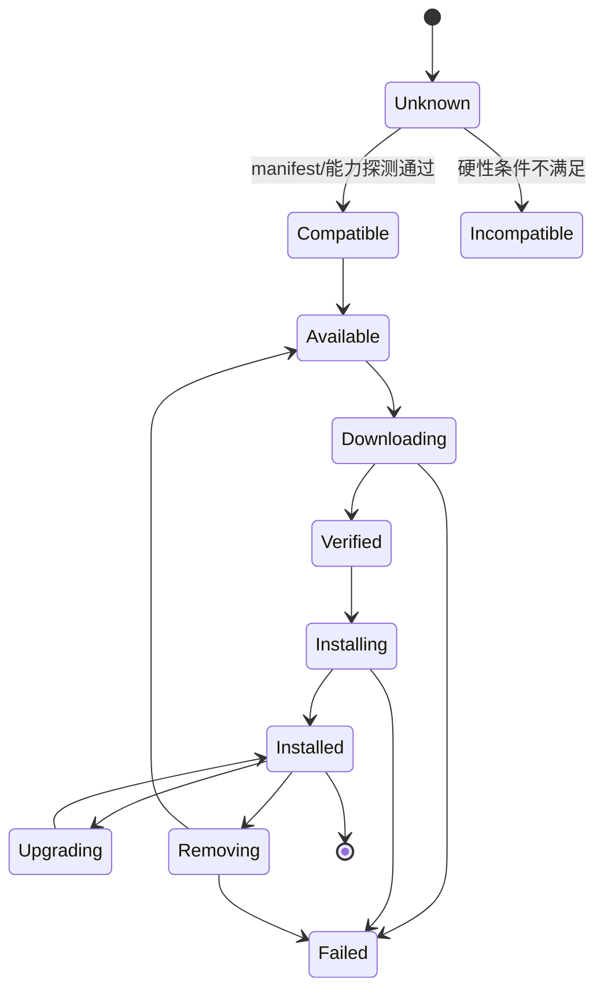

# TypixDeck Launcher + App Store 架构

## 1. 总体原则

- Launcher 是单页 GTK3 Shell；App Store 是独立用户态 GTK 应用。
- UI 进程保持普通用户权限。
- 系统变更交给短生命周期的授权 helper 或 systemd/polkit。
- Registry 是远端元数据 + 包分发层；本机状态由 SQLite/JSON 状态文件保存。
- 所有外部资源都是异步加载，UI 不被网络、apt 或磁盘扫描阻塞。
- 事件驱动优先：使用 GIO file monitor 和一次性行程，不做高频轮询。

## 2. 组件图



## 3. 进程与权限边界

### `typix-launcher`

- 用户进程，由 `systemd --user` 启动。
- 负责 UI、桌面入口扫描、设置和前台应用交接。
- 不直接以 root 执行安装。
- 只通过 GLib/GIO 子进程触发外部命令，且所有命令有超时和取消处理。

### `typix-store` / 授权安装路径

- 由 `typix-store` 请求、PackageKit/polkit 授权后短时间完成事务。
- 输入限定为本地缓存中已验签的 manifest 和 deb，或明确的 registry app id/version。
- 执行动作：
  - `verify`
  - `install`
  - `upgrade`
  - `remove`
  - `rebuild-desktop-cache`
- 每次执行写 systemd journal 日志。
- 不提供任意 shell、任意 apt 参数、任意文件路径安装。

### systemd units

- `typix-launcher.service`：用户 graphical session 服务。
- `typix-store-helper.policy`：polkit action 定义。
- 可选 `typix-store-cache-cleaner.timer`：清理损坏缓存，不做遥测。

## 4. Launcher 行为演进

### 现有行为必须保留

- 全屏窗口默认 800×600，实际自适应到屏幕。
- 根容器 20px 边距、14px 纵向间距。
- 宽度 ≥700px 时 3 列；<700px 时 2 列。
- 应用 tile 最小 180×150，图标 56px。
- 深色主题、青色 focus、红色危险按钮。
- 键盘：方向键、Home/End、Enter/Space、F5、F10、F11。
- 触摸点击、息屏后触摸唤醒。

### supervisor 策略

旧版实现：

1. systemd 启动 `--supervisor`。
2. supervisor 先启动 `--ui`。
3. UI 退出时若存在 request 文件，则读取 `.desktop` 并启动应用。
4. 应用退出后重新启动 UI。

这是 TypixDeck 的硬性产品要求，不是临时兼容策略。禁止改成 Launcher UI 常驻后台等待应用，原因是：

1. CM0 只有 512MB 内存，前台游戏/阅读器/MyAI 需要释放 UI 内存。
2. 全屏应用期间隐藏后台 Launcher 可减少 Wayland 合成压力。
3. 旧 CM4 真机已验证该流程，回归风险最低。

Store 下载/安装任务必须由独立 Store 进程或后续可恢复任务层持有，不能依赖 Launcher UI 常驻。

## 5. Desktop Entry 扫描

唯一来源是系统桌面目录中的 `*.desktop`：用 `xdg-user-dir DESKTOP` 探测，命令不可用时回退 `~/Desktop`。不扫描用户/系统 `applications` 或 Flatpak exports。目标文件可以保存在这些标准目录，但必须有桌面快捷方式引用它才显示在 Launcher。

解析规则：

- 使用 GIO `DesktopAppInfo` 优先；复杂 Link 或设备定制字段可用现有 configparser 逻辑补充。
- 忽略无效文件而不是中断扫描。
- `TryExec` 不存在则隐藏。
- 分类映射保持中文：游戏、影音、网络、系统、工具、应用。
- 文件变化用 `Gio.FileMonitor` 合并 250–500ms 后刷新。
- 空桌面显示添加快捷方式提示，不回退为全部已安装应用。

## 6. Store 状态机



下载和安装可取消的边界：

- 下载中：允许取消，临时文件删除。
- apt 已进入 commit 阶段：不允许取消，只显示“请勿断电”。
- 卸载前必须列出将要删除的包和用户数据路径。
- 升级出现依赖冲突时停止并保留旧版本。

## 7. 本机数据布局

```text
~/.local/state/typix-launcher/
  state.sqlite3                安装状态、下载任务、Registry revisions
  logs/                        launcher 用户日志；生产主日志仍进 journal
  registry/
    stable.json                已验签 manifest 副本
    objects/                   图标和截图缓存
~/.cache/typix-launcher/
  downloads/                   正在下载的 deb 临时目录
  thumbnails/                  可选，CM0 禁用
/etc/typix-launcher/
  registry.json                registry URL、channel、签名公钥、代理
```

包安装后仍然使用 Debian 标准：

- `/usr/share/applications/*.desktop`
- `/usr/share/icons/hicolor/...`
- `/var/lib/dpkg/status`
- `/var/log/apt/history.log`

## 8. 异常与恢复

- Registry 不可达：显示缓存 manifest 的时间和离线状态。
- manifest 签名失败：禁用 Store 安装，只显示本地应用。
- 磁盘小于包大小 + 200MB 保留空间：阻止下载。
- 电源状态未知或电池极低：阻止升级/安装。
- apt lock 被占用：显示“系统正在维护”，不自动反复重试。
- UI 崩溃：systemd `Restart=on-failure`。
- 安装后无 `.desktop`：详情页提示“应用缺少入口”，不假装启动成功。

## 9. 性能策略

- 图片解码在 worker 完成后投递回主线程。
- 图标缓存按 manifest revision 失效。
- Store 列表分页或增量插入，不一次性创建上万控件。
- 文本搜索 250ms 防抖。
- CM0 关闭截图、阴影、过渡动画和可选高清资源。
- 日志默认 info；debug 日志必须显式开启。
