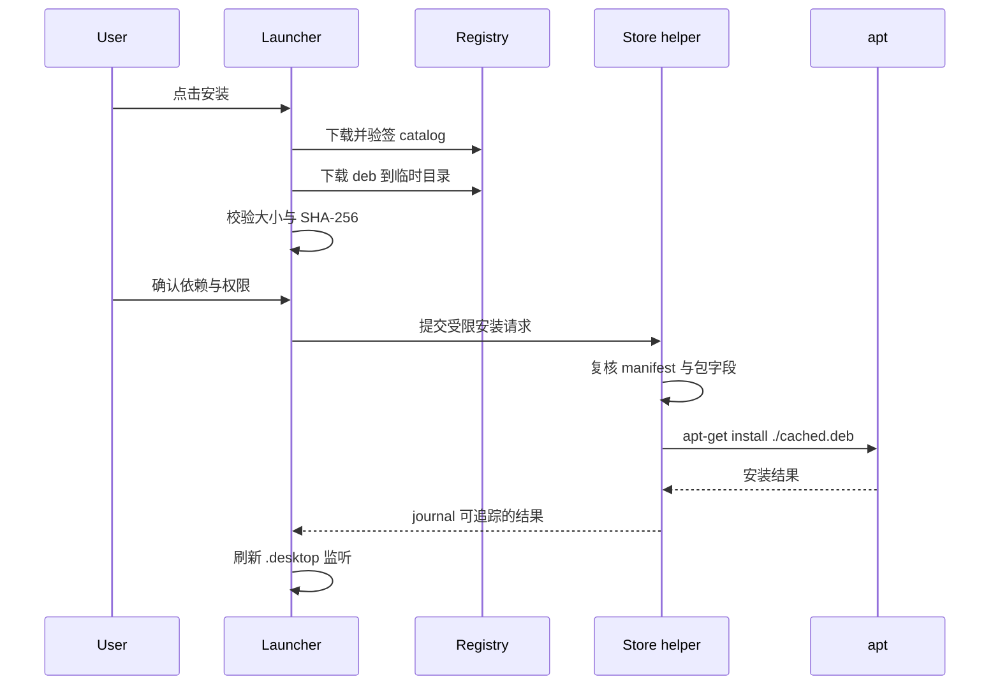

# TypixDeck App Store Registry 规格

## 1. 目标

建立面向 TypixDeck 的应用 Registry：

1. 提供中文/多语言应用元数据。
2. 分发面向 Raspberry Pi OS ARM64 优化过的 `.deb`。
3. 声明 CM0/CM4/CM5 与系统版本兼容性。
4. 支持 stable / beta / dev channel。
5. 支持增量更新、离线缓存和可验证安全链路。
6. 不采集用户安装清单，不要求账号。

Registry 分两层：

- **Catalog API**：面向 Launcher 的 JSON 元数据。
- **Artifact Store**：静态 HTTPS 文件服务，存放 `.deb`、图标、截图、changelog 和签名。

## 2. 目录与 endpoint

示例域名先用占位值，正式域名待定：

```text
https://registry.example.invalid/typixdeck/v1/
```

| Endpoint | 说明 |
| --- | --- |
| `GET /stable/catalog.json` | 稳定版 catalog |
| `GET /stable/catalog.json.minisig` | catalog 签名 |
| `GET /stable/apps/{appId}/index.json` | 单应用详情 |
| `GET /stable/apps/{appId}/{version}.json` | 单版本元数据 |
| `GET /stable/pool/{package}_{version}_{arch}.deb` | 软件包 |
| `GET /stable/icons/{hash}.png` | 图标 |
| `GET /stable/screenshots/{hash}.png` | 截图 |
| `GET /stable/changelogs/{appId}/{locale}.md` | 更新日志 |
| `GET /beta/catalog.json` | beta catalog |
| `GET /index.json` | Registry 能力与公钥轮换信息 |

Artifact URL 必须是 HTTPS，且 catalog 中不允许相对跳转到第三方未知域。确需 CDN 时使用显式 allowlist。

## 3. Catalog 顶层结构

```json
{
  "schemaVersion": 1,
  "channel": "stable",
  "revision": "20260911T120000Z",
  "generatedAt": "2026-09-11T12:00:00Z",
  "expiresAt": "2026-09-18T12:00:00Z",
  "defaultLocale": "zh-CN",
  "applications": []
}
```

规则：

- `schemaVersion` 只增不改语义。
- `revision` 全局唯一、字典序可比较。
- `generatedAt` 使用 UTC RFC3339。
- `expiresAt` 超过后 UI 显示缓存过期，但不删除本地应用。
- catalog JSON 使用 UTF-8、无 BOM、确定性键序。
- 换行统一 LF，签名前不做 UI 侧格式化。

## 4. Application 记录

示例字段：

```json
{
  "id": "com.example.demo",
  "package": "typixdeck-app-demo",
  "currentVersion": "1.2.0-1",
  "type": "application",
  "categories": ["utility", "developer"],
  "name": {"zh-CN": "示例应用", "en": "Demo"},
  "summary": {"zh-CN": "面向 TypixDeck 的示例应用", "en": "Demo app"},
  "description": {"zh-CN": "完整描述。", "en": "Full description."},
  "developer": {"name": "Example", "url": "https://example.invalid"},
  "license": "MIT",
  "homepage": "https://example.invalid/demo",
  "sourceUrl": "https://example.invalid/demo.git",
  "icon": "https://registry.example.invalid/typixdeck/v1/stable/icons/abc.png",
  "versions": []
}
```

### 版本记录

```json
{
  "version": "1.2.0-1",
  "releasedAt": "2026-09-01T08:00:00Z",
  "channel": "stable",
  "status": "stable",
  "compatibility": {
    "arch": ["arm64"],
    "os": ["raspios-trixie"],
    "cores": ["cm4", "cm5"],
    "minMemoryMB": 1024,
    "minFreeDiskMB": 256,
    "display": ["wayland", "x11"],
    "requiredFeatures": []
  },
  "artifact": {
    "arch": "arm64",
    "filename": "typixdeck-app-demo_1.2.0-1_arm64.deb",
    "url": "https://registry.example.invalid/typixdeck/v1/stable/pool/typixdeck-app-demo_1.2.0-1_arm64.deb",
    "sizeBytes": 1048576,
    "sha256": "0000000000000000000000000000000000000000000000000000000000000000",
    "installedSizeBytes": 4194304,
    "depends": [],
    "recommends": [],
    "conflicts": [],
    "provides": []
  },
  "desktopIds": ["typixdeck-demo.desktop"],
  "releaseNotes": {
    "zh-CN": "https://registry.example.invalid/typixdeck/v1/stable/changelogs/com.example.demo/zh-CN.md"
  },
  "permissions": {
    "network": false,
    "serialDevice": false,
    "audio": false,
    "inputMonitoring": false,
    "backgroundService": false,
    "systemConfiguration": false
  }
}
```

## 5. 兼容性语义

### `cores`

- `cm4`：当前真机主验收目标，完整功能。
- `cm5`：完整功能，允许更高分辨率与更强图形能力。
- `cm0`：只允许轻量应用或明确优化的降级模式。

`cores` 只是快速过滤条件，最终仍必须满足 `arch`、`os`、内存、磁盘和 requiredFeatures。

### `requiredFeatures`

使用稳定枚举，首版仅允许：

- `wayland`
- `x11`
- `touch`
- `keyboard`
- `audio`
- `network`
- `opengl-es-3`
- `vulkan`
- `nvme`
- `usb-serial`

不得把“型号猜测”放进 feature；例如需要串口时应声明 `usb-serial`，而不是让应用自行判断 CM4。

### 不兼容展示

- 硬性不兼容：默认不显示，可在搜索明确匹配时以“不适用”显示。
- 内存或磁盘不足：显示原因，不提供安装按钮。
- 实验性：显示警告，确认后允许安装。

## 6. 签名与校验

安全链路：

1. HTTPS 获取 catalog。
2. 使用 Launcher 内置 minisign 公钥验 `catalog.json.minisig`。
3. 校验 JSON schema、revision、channel 与当前配置。
4. 选择版本后下载 artifact 到私有临时目录。
5. 校验文件大小和 SHA-256。
6. 用 `dpkg-deb -f` 读取包字段，与 catalog 的 package/version/arch/depends 冲突项交叉校验。
7. 交给受授权的 store helper 调用 apt 安装。

规则：

- catalog 签名必须可分离，不能只依赖 TLS。
- 公钥随 Launcher deb 发布在 `/usr/share/typix-launcher/keys/`。
- 支持至少两把信任公钥，便于轮换。
- artifact 内容哈希必须写入已签名 catalog。
- 签名验证失败时禁用安装按钮，但不影响本地应用启动。
- 不执行 catalog 中任意 shell 命令。
- 不接受 `file://` artifact。
- 不允许重定向到与 allowlist 不同的最终主机，除非该主机也在 catalog 顶层声明。

## 7. deb 打包规范

### 包名

- 应用包：`typixdeck-app-{short-name}`。
- 运行时库：`typixdeck-{name}`。
- 主题/资源：`typixdeck-{name}-data`。
- 包名只能使用小写字母、数字、加号、减号和点。

### 架构

- 应用默认 `Architecture: arm64`。
- 纯脚本/纯数据可使用 `all`，但 catalog 的 `artifact.arch` 必须与 `dpkg-deb` 输出一致。
- 不提供 `armhf` 作为本项目首版目标。

### 文件布局

```text
/usr/bin/                       可执行文件
/usr/share/applications/        .desktop
/usr/share/icons/hicolor/       图标
/usr/share/typixdeck/apps/      TypixDeck 增强元数据
/usr/share/doc/{package}/       copyright、changelog
```

增强元数据示例：

`/usr/share/typixdeck/apps/com.example.demo.json`

该文件必须由 deb 拥有，用于 Launcher 离线恢复安装状态。

### 控制字段

最低要求：

```text
Package: typixdeck-app-demo
Version: 1.2.0-1
Architecture: arm64
Maintainer: Example <dev@example.invalid>
Section: x11
Priority: optional
Installed-Size: 4096
Depends: ...
Description: Short summary
 Long description.
```

要求：

- 依赖使用 Raspberry Pi OS / Debian archive 可解析包名。
- 不在 postinst 中访问网络。
- 不修改 Launcher、apt 源、sudoers、systemd 全局配置，除非包的明确目的就是该系统组件。
- 不捆绑已由 OS 提供的安全敏感库。
- 不把用户数据写入 `/root`、`/home/pi` 或包维护者脚本中的硬编码 Home。
- 图标和 `.desktop` 必须符合 FreeDesktop 规范。

### 优化要求

“TypixDeck 优化”至少满足以下一项，并在 catalog 中说明：

- 针对 3.2 英寸小屏与 800×600 逻辑 UI 调整。
- 支持键盘优先操作，不强制鼠标。
- 支持 Wayland 或明确通过 XWayland 验证。
- 降低内存、启动时间或包体积。
- 适配电池、息屏、音频、串口等设备边界。
- 提供 CM0 降级模式。

## 8. 版本与更新

- 应用版本使用 Debian version 语义。
- catalog 可保留最近 10 个版本，支持回滚。
- `currentVersion` 指向默认安装版本。
- beta channel 可以引用同一 artifact，但必须重新签名 catalog。
- 禁止原地修改已发布 artifact；修正必须发布新 revision 或新 Debian revision。
- Registry 保留 artifact 至少 12 个月，支持旧设备恢复。

## 9. 安装流程



推荐安装命令：

```bash
apt-get install -y --no-install-recommends /var/cache/typix-launcher/downloads/xxx.deb
```

说明：

- 使用 `apt install ./file.deb` 让 apt 解析依赖。
- helper 不接受用户提供的任意路径。
- 请求文件放在只有当前用户可写的 runtime 目录，helper 只读取固定 cache 根下的包。
- apt 事务完成后立即退出 helper，不做常驻 root 服务。
- 失败时保留下载文件供重试，但签名错误文件必须删除。

## 10. 发布流程

1. 开发者提交 app manifest 与 Debian packaging。
2. CI 在 ARM64 环境构建 deb。
3. CI 运行 lint、安装、启动、卸载和残留文件测试。
4. 在 CM4 真机完成冒烟测试；CM5 可用 QEMU/真机替代；CM0 声明支持时必须低资源测试。
5. 生成 artifact SHA-256 与 catalog。
6. 用离线 minisign 私钥签名 catalog。
7. 原子上传 artifacts 与 catalog。
8. 验证 stable endpoint 的签名、下载和安装。
9. 保留上一 revision 的回滚窗口。

## 11. 隐私

默认请求只包含：

- catalog path
- User-Agent：`TypixDeckLauncher/<version>`
- 系统 HTTP缓存头

不上传：

- 设备序列号
- CM 型号
- IP 定位
- 已安装应用列表
- 使用时长
- 用户输入

未来若提供推荐功能，必须默认关闭并向用户明示数据范围。
